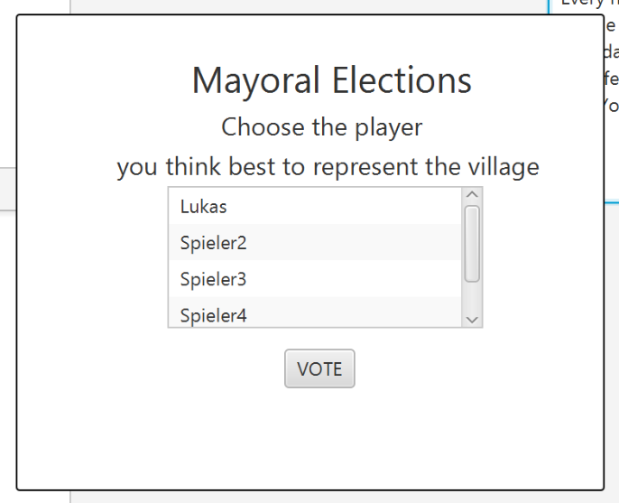
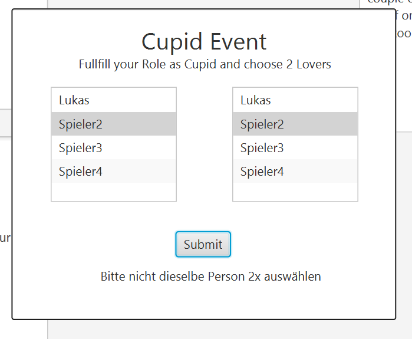
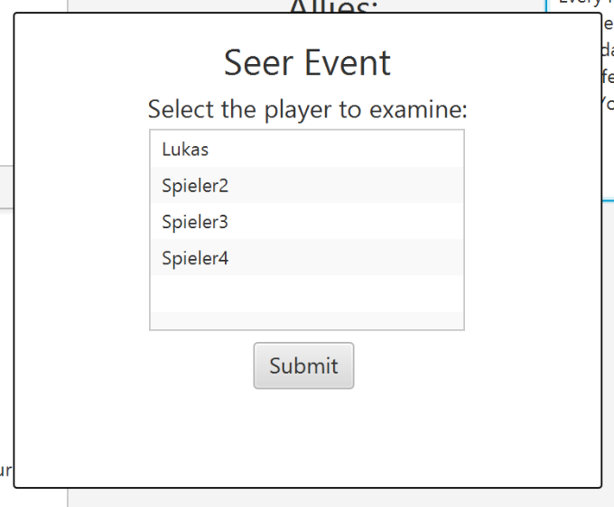
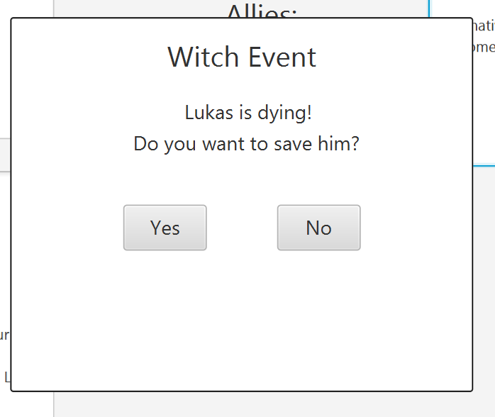
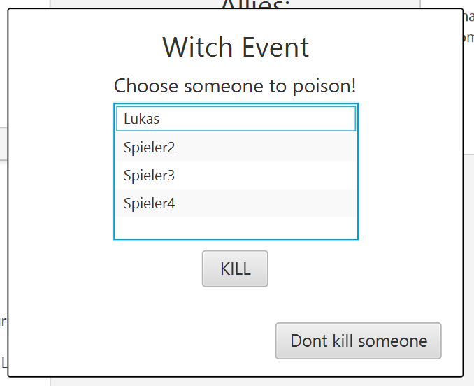
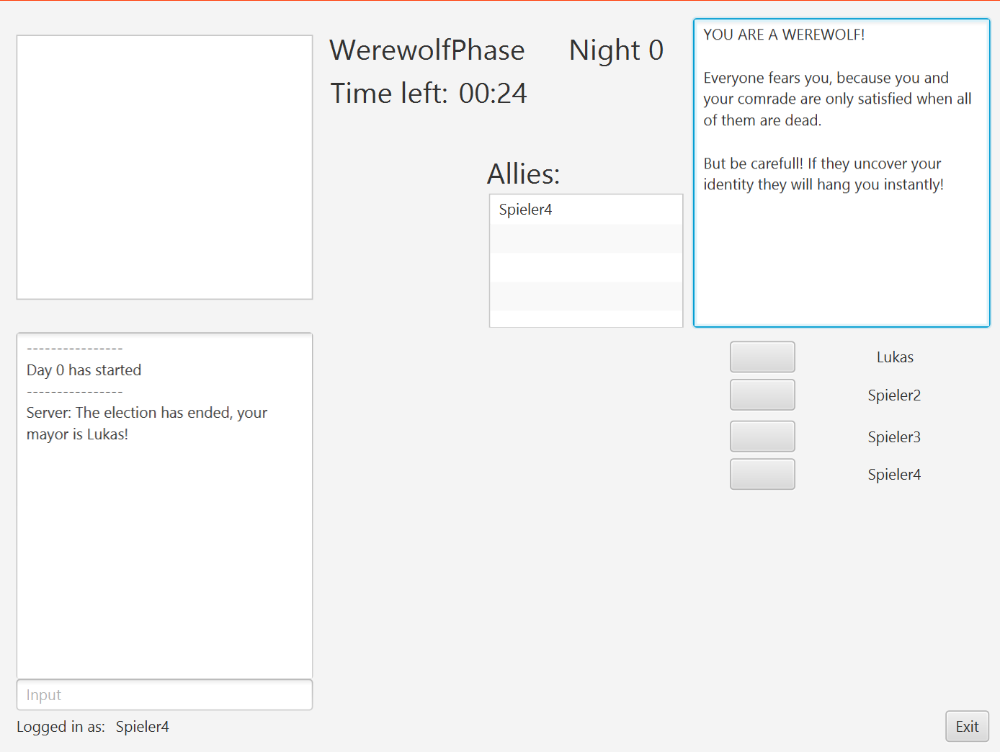
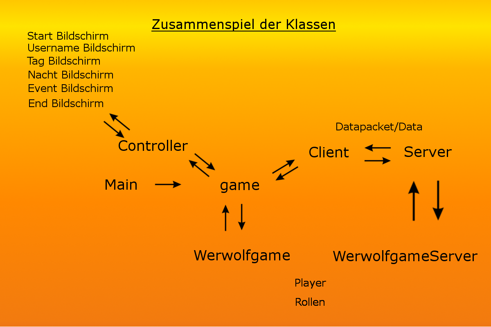

#Werewolf
##Inhalt 
1. Einleitung
2. Informationen zur Arbeit am Projekt
3. Logik    
    1. Simulation
    2. Rollen
        1. Zivilist
        2. Werwolf
        3. Hexe
        4. Seherin
        5. Cupid
        6. Bürgermeister
        7. Lover
    3. Spielablauf
    4. Wichtige Klassen der Logik
        1. WerewolfGame
        2. WerewolfGameServer
        3. Timer
4. Networking
    1. Allgemeine Funktionsweise
    2. Erste Version, ein einfacher textbasierter Chatserver
    3. Der fertige Multifunktionsserver
    4. Aufbau des Server
        1. Data
        2. WerewolfGameServer
        3. Client Package
            * Datapacket
            * Data
            * Message
            * Client
            * RWClient
        4. Server Package
            * Server
            * RWThread
            * Tuple
5. Graphical User Interface
    1. Allgemeine Informationen
    2. GUI für den einfachen textbasierten Chatserver
    3. Das Herzstück des Projektes: "game"
    4. Unterschiedliche "Screens" und ihre Controller
        * Controller, die basis abstract Klasse
        * StartScreen
        * UsernameScreen
        * DayScreen
        * Nightscreen
        * EventScreens
    5. Darstellung und Präsentation .. 
        1. zum Start
            * Wie hostet man ein Spiel?
            * Wie joined man einem Spiel?
        2. der Rollen
            * Armor
            * Bürgermeister
            * Seherin
            * Hexe
            * Werwölfe
        3. des Spielverlaufs
            * Chat
            * Tag/Nacht Wechsel
            * Tod
    6. Probleme und Verbesserungen bei der GUI
        1. Location not found
        2. Application Thread
        3. Steuern der GUI Elemente für jeden einzelnen Spieler
        4. Zuviele Screens?
6. Zusammenspiel der einzelnen Aspekte
    * Datenaustausch
    * Steuerung
7. Probleme bei der Entwicklung
8. Fazit
## Einleitung:
Thema unseres Projekts lautet "Werwolf". Hierbei handelt es sich um ein Gesellschaftspiel bzw. in unserem Fall um eine Online-Version, bei der man sich mit seinen Mitspielern über einen Chat absprechen kann um Entscheidungen zu treffen, welche dann hoffentlich auch zum Sieg führen. Die GUI ist hierbei an das Onlinespiel [ "Town of Salem" ](http://www.blankmediagames.com/) angelehnt während die Logik die des Gesellschaftsspiel "Die Werwöflfe von Düsterwald" übernimmt.

>  _Bei "Die Werwölfe von Düsterwald" (kurz: Werwolf) handelt es sich wie bereits erwähnt um ein Gesellschaftsspiel von min. 8 Spielern. Hier kämpfen die normalen Dorfbewohner gegen die Werwölfe. Es gibt zwei Phasen: Die Nacht-Phase und die Tag-Phase.
  In der Nacht-Phase werden Rollen wie "Hexe", "Seher" und "Werwolf" aktiv. 
  Die Rollen werden später noch weiter erläutert. -
  Die Werwölfe können ein Opfer wählen, welches mit Einbruch des Tages stirbt. Die Dorfbewohner müssen sich nun entscheiden, welchen ihrer Bewohner sie nun hinrichten, in der Hoffnung einen Werwolf zu erwischen, welche sich als Menschen getarnt ebenfalls unter den Dorfbewohnern befinden. Durch Abstimmung wird entschieden wen es erwischen soll.
  Gesiegt haben entweder die Dorfbewohner, wenn alle Werwölfe tot sind, oder die Werwölfe, falls ihre Spezies als einzige übirg bleibt._
##Informationen zur Arbeit am Projekt
Innerhalb der Gruppe haben wir uns darauf geeinigt das Projekt mithilfe der IntellijIDE zu programmieren. Das Projekt selber wurde aufgeteilt in 3 verschiedene Themengebiete welche einzeln bearbeitet wurden und dann im Laufe der Entwicklung miteinander verbunden wurden.
Außerdem basiert das Projekt auf der Java Version 1.8 und ist vollständig in der Englischen Sprache. 
Die Aufteilung der Themengebiete war wie folgt:
* Alexandro Steinert: Networking
* Lukas Allermann: GUI, sowie Zusammenführung der einzelnen Komponenten
* Johann Hein: Logik
* Tim Berger: Unterstützung beim Networking und der Logik

Trotzdem hat jedes Gruppenmitglied bei Problemen in anderen Bereichen mitgeholfen.
##Logik   
###Simulation
Zunächst einmal galt es sich über das Gesellschaftspiel "Die Werwöfle von Düsterwald" bzw. über die vom Prinzip ähnliche Online-Version "Town of Salem" zu informieren.

Um nun ein Gefühl für den generellen Spielablauf zu erhalten und um erste Ansätze zu finden wurde eine Simulation angefertigt. Hierbei handelt sich um ein textbasiertes Spiel, wobei ein einzelner die Rolle von 8 Spielern übernimmt und auch Einsicht in all das Geschehen besitzt.
Der simulierte Server fragt per print-Befehl nach Entscheidung des Spielers und jener antwortet per Eingabe. Ziel war es, den genauen Ablauf nachzuvollziehen und bereits ansatzweise zu testen. 

Während dem Erstellen der Simulation wurden die Rollen-Klassen als auch die Spieler-Klasse angefertigt, welche später benutzt wurden.
Die Methoden aus der Simulation wurden dann für den GameServer teils übernommen oder verändert wiederverwertet.
###Rollen
Wie bei dem Original gibt es auch hier mehrer Rollen. Es werden alle bis auf das "blinzelnde Mädchen" realisiert (Erweiterungen nicht mitgerechnet). Die Rolle eines Spielers ist geheim und wird erst mit dem Tod für andere Spieler sichtbar.
#### Zivilist:
Der Zivilist besitzt keine besonderen Fähigkeiten. Er stimmt wie jeder andere Bürger bei Tage über Bürgermeister und Hinrichtung ab und darf wie jede andere Rolle sich bei Tage im Chat mit den anderen unterhalten.

Ein Zivilist gewinnt, sobald alle Werwöfle tot sind!
(Win-Condition: good wins)

Diese Funktion besitzen alle Rollen und wird daher nicht nochmals bei jeder einzelnen erwähnt!
#### Werwolf
Die Werwölfe besitzen ihre eigene Phase bei Nacht, in der sie miteinander chatten können um ein Opfer auszuwählen. Dieses stirbt dann sobald die Tag-Phase einsetzt.

Ein Werwolf gewinnt, sobald nur noch Werwölfe unter den Spielern existieren.
(Win-Condition: evil wins)
#### Hexe
Die Hexe ist in der Nacht-Phase nach den Werwölfen am Zug. Sie besitzt einen Heiltrank und einen Todestrank. Mit dem Heiltrank kann sie das Opfer, welche von den Werwölfen gewöhlt wurde, retten. Mit dem Todestrank kann sie einen Spieler ihrer Wahl töten. Ist ein Trank benutzt worden ist er fort und die entsprechende Fähigkeit ist dann für den Rest des Spiels blockiert.
(BEIDE Tränke können auch auf sich selbst gewirkt werden!)

(Win-Condition: good wins)
#### Seherin
Die Seherin kann sich zu Beginn jeder Nacht-Phase vom Spiel sagen lassen, ob ein Spieler ihrer Wahl GUT oder BÖSE ist. Die genaue Rolle wird hierbei aber nicht aufgedeckt!

(Win-Condition: good wins)
#### Cupid
Zu Beginn des Spiels darf der Cupid (Amor) zwei Liebende auswählen – sich inbegriffen – welche versuchen müssen, einander zu beschützen. Es ist durchaus möglich, einen Werwolf und einen Zivilisten als Paar auszuwählen.

(Win-Condition: good wins)
#### Bürgermeister
Jeder Spieler kann zum Bürgermeister gewhält werden – es handelt sich nicht um einen direkte Rolle sondern, eher einem Titel mit einer speziellen Funktion.
Falls es keinen Bürgermeister gibt, weil dieser Bürgermeister wurde, wird einer während der Tag-Phase von allen Spieler gewhält.

Für den Fall, dass bei der Wahl für die Hinruchtung eine Patt-Situation entsteht, darf der Bürgermeister entscheiden, welcher Spieler (von den meist gewählten) hingerichtet werden soll.
(Für Patt-Situation bei den Werwölfen oder der Wahl des Bürgermeisters selbst entscheidet ein Zufallsprinzip!)
#### Lovers
Hierbei handelt es sich um zwei Spieler mit ihrer eigenen zusätzlichen Win-Condition.
Es gilt: Wird einer der beiden getötet, so stirbt der andere automatisch.

Falls es sich bei den Liebenden nicht um dieselbe Spezies handelt sondern um gut und böse, so können diese trotzdem gewinnen, indem sie als einzige überleben.
(Win-Condition: lovers win)
### Spielablauf
In dem Moment, wo ein Spieler einen Server hostet, wird eine Art Lobby erstellt.
Sobald die Lobby voll ist (7 Spieler), beginnt das Spiel und jedem Spieler wird eine Rolle zugewiesen.
Ein Spiel läuft folgender Weise ab:


Das Spiel betritt nach der Startphase einen Kreislauf. Wenn aufrund des Spielgeschehens der amtierende Bürgermeister sterben sollte, findet eine Neuwahl statt, worauf dann der normale Spielverlauf fortgesetzt wird. Sollten die Spieler welche wichtige Stationspunkte des Kreislaufes vertreten bereits verstorben sein, wird diese Phase übersprungen. Das Spiel überprüft an den wichtigen Stellen den aktuellen Stand und beendet das Spiel sollte einer der "Win Conditions" erfüllt sein. Tote Spieler können den Spielgeschehen weiter folgen, haben aber keinerlei Auswirkung mehr auf den Rest des Spieles. Sie können weder den Chat benutzen noch ihre Rolle ausführen, geschweige denn Voten. Allerdings müssen Tote Spieler das Spiel bis zum Ende offen haben.
### Wichtige Klassen der Logik:
#### WerewolfGame
Diese Klasse regelt die Logik auf der Seite des Clients und enthält alle wichtigen Attribute des Spiels. Die Methode dataProcessing der Klasse wird bei erhaltenem Data-Objekt aufgerufen und ist die "Zentrale" der Clientlogik.
Die Klasse liest den Tag des Data Objects aus und leitet dementsprechend ein Event ein.
Hat ein Client seine Aufgabe erledigt wird ein Data Object zurück an den Server geschickt.
#### WerewolfGameServer
Diese Klasse regelt die Logik auf  der Server Seite und fungiert als übergeordnete Steuerzentrale.
Der Server hat den aktuellsten Spielstand und sendet regelmäßig Updates an alle Clients. Zudem wird hier die Win-Condition überprüft.
#### Timer
Diese Klasse symbolisiert einen frei einstellbaren Timer, seine Hauptaufgabe ist für die Werwolf bzw. TownVote Phase, jede Sekunde die GUI zu aktualisieren und nachdem der Timer abgelaufen ist eine bestimmte Funktion aufzurufen welche den letzen Buttonklick der vorangegangenen Phase an den Server schickt. Damit dieser nicht den Application Thread blockiert betreibt er einen eigenen Thread.
##Networking
### Allgemein
Das Networking im Spiel wird mithilfe des java.net packages und des java.io Package durchgeführt.
Es ist einfach aufgebaut in der Hinsicht, dass es einen Server gibt auf dem Clients joinen können und über welchen dann Daten an Clients gesendet werden.
Das Networking insgesamt besteht aus einem Server package und einem Client package.
### Erste Version, ein einfacher textbasierter Chatserver
Das Server/Client-Modell wurde zuerst in der 2.Woche als Chatserver aufgestellt. Dieser war zunächst ein ganz einfacher Chatserver, bestehend aus einem Server, der für jeden Join-Request einen neuen Thread öffnet, welcher sich um diesen User kümmert und einem Client, welcher für jeden Read/Write des Client auch einen neuen Thread öffnet. Die jewiligen Threads sind Klassen. 
Bei dieser Version des Servers wird ein Selbsterstellte Message Objekt, welches aus 3 Strings besteht, Sender, Receiver und Message, über den Object-Output-Stream und Input-Stream an den Server und vom Server an die Clients gesendet.
Diese Version des Servers unterstützt Whispern mithilfe von "@Username",
jedoch geschieht die Untersuchung für wen die Nachricht ist auf Userseite, mit anderen Worten: Jede Nachricht wird an jede Person gesendet.
### Der fertige Multifunktionsserver
Der fertige Server ist eine revidierte Version des anfänglichen Servers und ist in Woche 3 entstanden.
Es wurden folgende Dinge geändert :
* Ein Datapacket Objekt wurde entwurfen, dass dazu dient die verschiedenen Daten zwischen Server und Client hin und her zusenden.
* Es wurde ein Handshake eingeührt
* Durch den eingeführten Handshake wurde Whispern nun verbessert, sodass der Server Nachrichten für bestimmte Leute nur an diese sendet
* Die vorher entstandene jedoch relativ nutzlose Tuple Klasse wurde nun vernnünftig eingbaut: Diese speichert Serverseitig zusammengehörige Usernames und Obejct-Output-Streams.
### Aufbau des Servers
Alle Klassen befinden sich übergeordnet in einem Network Package, zudem werden einige Klassen unterteilt in Server und Client Packages
#### Data
Bei der Data Klasse handelt sich um eine Ansammlung von Spieldaten, die zu der Ausführung des Spiels benötigt werden. Data hat einen String als Tag der zur Idenntifikation der Daten dient.
#### WerewolfGameServer
Teil des Networking Packages, da es jedoch die Logik regelt befindet sich eine Erklärung zum Server im Kapitel Logik. 
#### Client Package
##### Datapacket
Bei dem Datapacket handelt es sich um eine selbsterstellte Klasse zum senden und empfangen von Daten. Das Datapacket hat eine Public ID, welche eine Integer Zahl ist und anzeigt, was sich im Datapacket befindet ( 0 = Handshake, 1 = Message, 2 = Spieldaten für die Logik).
##### Message
Die Message Klasse wird pimär für den Chat verwendet, sie besteht aus 3 Strings: Sender, Receiver und Message. Das Objekt wird jedoch auch für den Handshake mitverwendet.
##### Client
Der Client kann sich mit dem Server verbinden. er besitzt  einen Username, welcher zum einen der Namen des Users ist zum anderen aber auch als ID für den Client agiert. Der Client öffnet jeweils zum Schreiben/Lesen vom server einen Thread.
##### RWClient
Hierbei handelt sich um den Thread des Clients - er implementiert also Runnable. Der Thread wird sowohl zum Lesen vom Server als auch zum Schreiben an den Server verwendet. Der Thread wertet erhaltene Daten aus.
#### Server Package
##### Server
Der Server kann Daten an Clients senden und von Clients erhaltene auswerten und weiterleiten. Für jeden Client der sich mit dem Server verbindet wird ein neuer Thread geöffnet.
##### RWThread
Der Thread empfängt Daten von Clients und gibt diese nach Auswertung an den Server zum verschicken weiter. Da es sich hier auch um  einen Thread handelt implementiert er Runnable.
##### Tuple
Das Tuple ist eine selbsterstellte Klasse, die einen Usernamen als  String und den dazugehörigen Object-Output-Stream speichert. Diese Klasse wird genutzt um alle verbundenen Clients zu speichern.
## Graphical User Interface
### Allgemeine Informationen
Für die GUI benutzen wir JavaFX. Mit dem Scenebuilder wurde für jede Scene eine fxml erstellt die ihren eigenen Controller besitzt. Diese haben einen Verweis auf die "game" Klasse. In den Controller Klassen befindet sich jegliche Logik die das Projekt zum richtigen Darstellen des Spiels brauch, angefangen bei den Funktionen für den Chat, bis hin zu update- sowie prepare Funktionen welche die jeweilige Scene auf bestimmte Phasen vorbereitet. <br> Alle Screens besitzen ein festes Format von 800x600 px und das Fenster lässt sich nicht vergrößern oder verkleinern. Diese Entscheidung basierte darauf, das AnchorPanes sich schwer eigneten um die GUI anpassbar zu machen, wir uns aber in der Gestaltung des Spieles soviele Freiheiten wie möglich nehmen wollten. Das hat vlt. einige Anzeigefehler zu Ursache welche grade bei Linux Rechnern auftreten, wir aber nicht beheben können. Getestet wurde die Auflösung auf Windows Rechnern mit einer Auflösung von 1920x1080p sowie 2560x1440p. Auch die eingestelle Skallierung hat Auswirkung und muss noch beachtet werden.
### GUI für den einfachen textbasierten Chatserver
Zur Übung für den Umgang mit fxml Dateien, Controllern und eine Verknüpfung zur Logik, wurde für den Systemkonsolen basierter Chat von Alex eine externe Application entwickelt welche diesen Chat mit einer GUI aufstockte. Dabei wurden wichtige Grundkenntnise erschlossen, welche für das spätere Projekt unglaublich hilfreich waren. Unteranderem die Umsetzbarkeit eines Chats. Wie genau Controller funktionieren und wie man Elemente anspricht.
### Das Herzstück des Projektes: "game"
Die Klasse game wurde ursprünglich als Startpunkt für die GUI gedacht in welcher sich später auch die Client seitige Logik des Spiels befindet. Diese Idee wurde aber verworfen und die Logik wurde in das "Werwolfgame" verschoben. "game" dient jetzt als ein Verbindungsknoten durch welche Client, Logik und GUI, kommunizieren können. Trotzdem enthält er einige Klassen die das Spiel bis zur Vorbereitungsphase führen.
#### Controller, die basis abstract Klasse
Während des Spiels, wollten wir eine Klasse haben welche immer die aktive Scene symbolisiert. Anfangs hatte diese Klassen auch selber noch Funktionen, wurde aber später in eine abstrakte Klasse umgewandelt. Der DayScreenController und NightScreenController werden hier jeweils aktiv gespeichert. 
#### StartScreen
Der StartScreen besitzt ein Logo sowie insgesamt 4 Buttons. Das Logo entstand ursprünglich aus einem Spaß mitten in der Nacht. Wurde aber nach einiger Zeit normal und wurde einfach behalten. Wenn man auf den Start Button klickt offenbaren sich 2 weitere Buttons welche ermöglichen sich zu Entscheiden ob man das Spiel als Host starten- oder sich mit einem Host verbinden möchte.
#### UsernameScreen
Der UsernameScreen passt sich der Entscheidung aus dem StartScreen an. Je nach Auswahl ist das IP Fenster die IP des Hosts, oder eine freies Textfeld in welche man die IP des Hosts eingeben kann. Wie beim Network bestimmt erwähnt ist der Port hierbei konstant auf 2412. Diese kann hier für den Client auch verändert werden. Der Client des Spielers wird nämlich in diesem Screen erstellt, je nach bestimmten Namen und Richtigkeit der IP wird man weitergeführt. Doppelte Namen sind nicht erlaubt, sowie zu Kurze oder garkeinen Namen. In den Fällen wird das dem Spieler mit Labels mitgeteilt. Bei einem Fehler des Servers beim verbinden oder beim erstellen gibts allerdings kein bestimmtes Label. Solche Fehler kann man bislang nur in einer Konsole nachvollziehen. Für die Entwicklung wurde eine Funktion eingebaut mit der man durchs Drücken der Enter Taste nach dem man seinen Namen eingegeben hat, automatisch probiert, auf den "localhost" zu connecten. Diese Funktion hat viel Zeit erspart und kann vom Hoster ohne Bedenken benutzt werden.
#### DayScreen
Sollte die Verbindung geklappt haben, befindet man sich im DayScreen. Dieser hat einen Chat mit EingabeFeld, einen Friedhof, ein Feld für seine Rollenbeschreibung sowie eine Liste aller Spieler. Dieser Screen ist sehr stark an dem SpielScreen von Town of Salem angelehnt. Wenn man Host ist, wird einem seine IP weiterhin in einem bestimmten Label angezeigt, sodas man auch nach Scenenwechsel diese an seine Freunde weitergeben kann. Ansonsten befinden sich auf dem Screen viele Unsichtbare Elemente. Zum einen die Vote Buttons für die Town Phase, sowie ein EventScreen welcher für Tag Rollen jegliche Events darstellen kann(Mehr unten). Tagsüber können alle Lebenden Spieler chatten, und auch flüstern. Die Konvention folgt dem Schema: "```@NameDesSpielers Message```". Viele Informationen des Spiels werden in dem Chat festgehalten. Dieser bleibt über das gesamte Spiel erhalten. Zusätzlich befinden sich allerlei Label und Informationen auf dem Screen. So sieht man die aktuelle Phase, ein Timer welche bei Bedarf sichtbar geschaltet wird, den aktuellen Tag und ein Fenster für die Werwölfe welche ihre Verbündeten darstellt. Sollte man sich durch den Armor verlieben. Zeigt dieses Fenster sich und seinen Partner an.
#### Nightscreen
Der NightScreen sieht sogut wie genauso aus, wie der DayScreen. Nur kann man verschiedene Dinge hier nicht. Es können sich nurnoch Werwölfe unterhalten. Die Flüster Funktion gibts auch nicht mehr. Auch hier befinden sich für die Werwölfe unsichtbare Votebuttons und ein Eventfenster für die Nacht Rollen. Timer, Label usw. sind natürlich ebenfalls enthalten.
#### EventScreens
Der Eventscreen ist dazu konzipiert in den DayScreen bzw. NightScreen integriert zu werden. Er besitzt allerlei Container welche jeweils ein Event für eine Rolle darstellen. Diese können unterschiedlich sichtbar geschaltet werden um so ein möglichst kompakten Screen zu bekommen. Zusätzlich konnten über den EventController viele Funktionen abgetrennt werden von den eh schon überfüllten Day-/NightScreen Controllern. Der EventScreen besitzt eine Verlinkung auf "game" und die Day-/NightScreen eine Verlinkung zum EventController.
### Darstellung und Präsentation ..
#### ..zum Start
Das Spiel sollte zum Start so Simpel wie möglich sein. Anfängliche Ideen von einem Setting Screen oder Customizable Avatare, Namen etc. wurden demnach entworfen.
##### Wie hostet man ein Spiel?
In dem man auf dem "Host Game" Button drückt.
##### Wie joined man einem Spiel?
In dem man auf den "Join Game" Button drückt.
#### ..der Rollen
##### Bürgermeister
Der Bürgermeister besitzt 2 verschiedene Fenster. <br> Zu beginn des Spiels wird der Bürgermeister von allen Spielern gewählt. Bei Gleichstand zwischen den meistgevotesten Random entschieden. Das Event wird jedes mal ausgerufen wenn der Bürgermeister gestorben sein sollte.
<br><br>
Sollte bei einer Town Abstimmung ein Unentschieden entstehen. Darf der Mayor entscheiden welche dieser Personen gelynched werden soll.
<br><br>
##### Armor
Der Armor hat seinen Zug direkt zu Spielbeginn, nach der Wahl des Bürgermeisters. Durch 2 ListView Elementen kann dieser 2 unterschiedliche Spieler auswählen. Diese 2 Spieler werden überprüft ob es sich um die selben handelt, und wenn nicht an den Server weitergeleitet.
<br><br>
##### Seherin
Die Seherin besitzt das Privileg herauszufinden ob der ausgewählte Spieler ein Werwolf ist. Anhand ihrer Auswahl wird ihr die Gutartigkeit des Ausgewählen Spielers offenbart.
<br><br>
##### Hexe
Die Hexe kann den Spieler der von den Werwölfen verletzt wurde mit ihrem Heiltrank heilen. Verbraucht diesen dann Allerdings.
<br><br>
Zusätzlich kann sie ihren Gifttrank auf einen der Spieler werfen. Welcher in folgen der Vergiftung verstirbt.
<br><br>
##### Werwölfe
Die Werwölfe können sich normal Unterhalten. Zusätzlich können sie solange der Timer läuft ihre Votes durch einen Button auswählen. Bei Gleichstand entscheidet der Zufall. Der Druck auf einen Button speichert lediglich den Spieler in einer speziellen Variable. Sobald der Timer abläuft, ruft dieser eine Funktion auf welche diese Variable nimmt und an den Spieler schickt. So kann man seine Auswahl während der Phase noch ändern.
<br><br>
#### ..des Spielverlaufs 
##### Chat
Der Chat ist sehr sehr Simpel aufgebaut. Spieler haben ihren Namen, es gibt keinen Schimpfwort Filter oder anderweitiges. Tagsüber kann man Flüstern, Nachts können nur Werwölfe schreiben.
##### Tag/Nacht Wechsel
Der Tag/Nacht Wechsel wäre mit Hintergrund Wechsel leichter zu erkennen. Leider fehlte dazu die Zeit. Der Einzige Hinweis sind bis jetzt, Meldungen im Chat sowie das Label welche den aktuellen Tag/Nacht anzeigt
##### Tod
Beim Tod kann der Spieler trotzdem noch das Spielgeschehen folgen. Seine Roleninformationen werden gelöscht und mit einem kleinen Text ersetzt. Seine Elemente zum Einwirken auf das Spielgeschehen werden entfernt und werden auch nichtmehr angezeigt.
### Probleme und Verbesserungen bei der UI
#### Location not found
Eine "Location not Found" Exception tritt dann auf wenn in der Projektstruktur der recources Ordner NICHT als recource ordner markiert ist!
#### Application Thread
Durch googlen fanden wir heraus, das Klassen nicht so leicht auf die GUI zugreifen können, wenn dieser auf einem Anderen Thread liegt. Auch durch andere Gründe gab es öfter Exceptions die auf JavaFX zuführen waren. Manchmal auch Exceptions welche in keiner der von uns geschrieben Klassen aufgerufen wurde, bzw. keiner der von uns geschriebenen Klassen tauchte im Stacktrace auf. 
```Platform.runLater(()->);``` war die Lösung.
#### Steuern der GUI Elemente für jeden einzelnen Spieler
Am Anfang mussten wir uns Entscheiden zwischen dem Vorgehen jedes Datenpaket nur an dem bestimmten Spieler zu verschicken, oder alles an Alle zu verschicken und einfach nur beim richtigen Spieler "wirken" zu lassen. Die aktuelle Lösung ist ein Gemisch von beiden dieser Versionen. Chatnachrichten werden Nachts bspw. an Alle Spieler verschickt. sollte man selber allerdings Town sein, werden diese nicht angezeigt.
#### Zuviele Screens?
Während der Entwicklung konnte sich Abzeichnen das der Tag/Nacht ruhig auf einen Screen hätten funktionieren können. Allerdings bemerkten wir auch das selbst jetzt die Controller Klassen äußerst überfüllt seien. Und wir deswegen zufrieden sind mit unserer derzeitigen Lösung
## Zusammenspiel der einzelnen Aspekte
<br>
### Datenaustausch
Der Datenaustausch auf dem PC läuft über die game Klasse. Viele Funktionen werden einfach als Verlängerung benutzt welche dann die Funktion in der jeweiligen Klasse aufrufen. <br> Zwischen dem Client und dem Server werden die Klassen Datapacket und Data benutzt. Welche mit bestimmten tags versehen wurden. (Mehr dazu in der Erklärung zu Werwolfgame/WerwolfgameServer)
### Steuerung
Ein Aspekt der garnicht direkt aufviel war das Problem das wir über Objektstreams keine direkten Funktionsaufrufe machen konnten, welche vlt. sogar nen ```return``` Wert haben. Als Lösung besitzen wir jetzt ein ausgeklügeltes tag System, welches für jegliche Spielentscheidung einen bestimmten Tag verarbeitet. Das passiert sowohl im Server als auch am Client.
## Probleme bei der Entwicklung
Ein Problem an dem wir lange saßen war ein Problem welche mit unserer Unkenntniss mit Streams zutun hatte. So trat bei uns der Fehler auf das an 2 Clienten dieselbe Liste verschickt wurde, bei einem der beiden allerdings als eine um einen kleinere Liste angekommen ist. Dieser Fehler löste an mehreren Stellen und bei unterschiedlichen Leuten Bugs aus, welche Augenscheinlich nix miteinander zutun hatte. Problem war das der Reader nie resettet oder geflused wurde. <br> Ein anderes Problem was wir oft hatten waren die Komplikationen die auftraten wenn Personen unterschiedliche Anwendungen entwickelten welche allerdings nicht zusammen funktionieren konnten. Erst als Alle ein generelles Verständniss von allen Fachgebieten erlangten, wurden solche Probleme immer weniger. <br> Ansonsten wurde natürlich fleißig Buggefixed. Oft länger als man neues Implementierte. Dabei beobachteten wir wieviel Zeit Bugfixing von einem Spiel beanspruchen kann, wenn man keine Möglichkeit hat, zu bestimmten States des Spiels direkt zu springen. Bei jedem Bug durften wir das Spiel neu spielen bis zu dem Punkt, wo der Bug auftrat. Das war für dieses Projekt zwar nicht fatal, kostete aber trotzdem wertvolle Zeit. <br> Auch jetzt sind wir uns sicher, dass sich bestimmt ein paar Bugs in die aktuelle Version geschlichen haben. Wir haben allerdings sichergestellt, dass das Spiel in seinem jetzigen Stand spielbar ist. Und Bugs nur in den seltesten Fällen auftreten. Das Spiel wurde lange Zeit nur mit 4 Spielern getestet um das Bugfixing zu erschnellern. Sollte dieser Zustand getestet werden sollen, müssen nur 2 kleine Dinge im Code verändert werden: 
1. In der Klasse RWThread muss in Zeile 108 die if Bedinung auf die Anzahl der Spieler (4) reduziert werden. ```server.getTulist().size() == 4)```
2. In der Klasse WerewolfgameServer müssen in der Funktion ``private void generatePlayers()`` Die Rollen auskommentiert werden welche nicht benutzt werden. Dies verhindert Fälle in denen bspw. kein Spieler die Werwolf Rolle zugewiesen wird. Solch eine Abfrage existiert bis dato nicht. Die Test-Konstolation besteht aus "Cupid, Seher, Werewolf, Witch"
## Fazit
Das Ergebnis des Projekts ist eine Spielbare Online-Version des Gesalltschaftsspiel "Die Werwöfle des Düsterwalds".
Wie bei allen Projekten gibt es Optimierungsbedarf, unserer Meinung nach ist das Projektziel erreicht worden. Die Arbeit an diesem Projekt hat uns beigebracht in einer Gruppe ein Programm zu erstellen und uns mit Projektmanagment sowie Git auseinanderzusetzen.
Jeder von uns hat hat sehr viel Spaß gehabt beim Entwickeln dieses Spiels, was bis jetzt eines der ersten solcher Programme war. Und sich weit von den bisherigen Programmieraufgaben aus unserem Studium unterschied. <br><br>
_Geplant ist es das Spiel privat weiterzuentwickeln und Ideen einzufügen für die aufgrund von Zeitdruck keine Zeit war!_ <br>

### Quellenangaben
Das Logo ist mit Gimp aus folgenden Elementen erstellt worden <br>
[Bild des Werwolfs](http://runescape.wikia.com/wiki/File:Werewolf_(Heist).png)<br>
[Hintergrund Bild](https://forum.unity.com/attachments/03-jpg.55294/)<br>
[Bild des Mondes](http://www.pngmart.com/files/4/Moon-PNG-Image.png)
